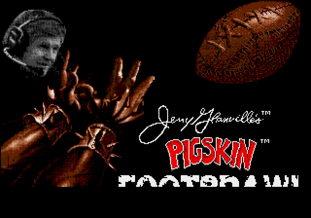

# Pigskin Footbrawl: Recompiled

A static recompilation of *Jerry Glanville's Pigskin Footbrawl* (Sega Genesis,
1992). The game's 68000 code is translated ahead of time into C and compiled
into a native Windows program. The Genesis video, sound and I/O chips come from
[genrecomp](https://github.com/sp00nznet/genrecomp), which wraps Genesis Plus GX.

You supply your own ROM. Everything generated from it stays on your machine:
this repo contains the tools and the hand-written glue, never the ROM, its
disassembly, or the C generated from it.

## Status

**Alpha.** It boots through the SEGA and RazorSoft logos, the title and
credits, and the options and skill-level menus, then plays a full one-player
game: kickoff, tackles, passes, touchdowns, the period clock running down. A
scripted 9,000-frame headless run (2.5 minutes of play) finishes in about 17
seconds with no aborts.

Not verified yet: audio (the sound driver runs and is mixed, but nobody has
listened), a match played to the final whistle, and two-player. It is built
by genrecomp's shared recompiler, which also runs General Chaos. Known issues are
in [docs/debugging.md](docs/debugging.md#known-issues).

## Screenshots

Recorded headless from the recompiled build:




## Getting Started

You need your own *Jerry Glanville's Pigskin Footbrawl (USA)* ROM: 1 MB,
unzipped (`.gen` or `.bin`). Windows 10/11 only for now.

### Quick start

1. Download this repo (Code → Download ZIP) and unzip it, or clone it.
2. Put your ROM in the same folder (or have its path ready).
3. Double-click **`Setup.cmd`**. It checks for Git, CMake, Visual Studio 2022
   (C++ workload), Python 3 with `capstone`, SDL2 (via vcpkg) and genrecomp,
   and **asks before installing** anything missing, saying what and how big.
   It then checks your ROM, generates the C source from it, builds, and runs a
   600-frame headless smoke test. If a step fails, it stops with one sentence on
   what to do and keeps the details in `setup.log`. Rerunning skips finished
   steps.
4. Double-click **`Play Pigskin.cmd`**, which Setup leaves in the folder.

### Step by step

Prerequisites: Git, CMake 3.16+, Visual Studio 2022 with "Desktop development
with C++", Python 3.10+ with `capstone` (`py -3 -m pip install capstone`), SDL2
via vcpkg (`C:\vcpkg\vcpkg.exe install sdl2:x64-windows`). `ffmpeg` on PATH is
only needed for `--record`.

1. Put genrecomp beside this folder:
   ```
   gen\
     genrecomp\   git clone --recursive https://github.com/sp00nznet/genrecomp.git
     pigskin\     this repo
   ```
2. Generate the C source from your ROM (about 10 s):
   ```
   py -3 ..\genrecomp\tools\recompiler\generate.py "path\to\Pigskin.gen" -o src\recomp -c recomp.json
   ```
   Expected last lines: `Generated 27 source files with 1340 functions` (give or take one) and `Done!`.
3. Configure and build:
   ```
   cmake -S . -B build -G "Visual Studio 17 2022" -A x64 -DCMAKE_TOOLCHAIN_FILE=C:/vcpkg/scripts/buildsystems/vcpkg.cmake
   cmake --build build --config Release
   ```
   Expected last line: `pigskin.vcxproj -> ...\build\Release\pigskin.exe`.
4. Run it:
   ```
   build\Release\pigskin.exe "path\to\Pigskin.gen"
   ```

Usual trip-ups:
- `python` opens the Microsoft Store: that's the Store alias, not Python.
  Use `py -3`, or turn the alias off in Settings → Apps → App execution aliases.
- `ModuleNotFoundError: No module named 'capstone'`: `py -3 -m pip install capstone`.
- `src/recomp/ is empty` from CMake: step 2 hasn't run.
- A new terminal is needed after installing a tool, so PATH picks it up.

## Usage

Controls: arrow keys = D-pad, Z/X/C = A/B/C, Enter = Start, Esc = quit.

Headless (no window; works over RDP), recorded to video, with scripted presses
that start a one-player game:

```
build\Release\pigskin.exe --headless --frames 6000 --record game.mp4 ^
  --press 2300:START:10 --press 2600:START:10 --press 2900:START:10 --press 3200:START:10 ^
  "path\to\Pigskin.gen"
```

All flags (`--headless`, `--record`, `--frames`, `--press`, `--ram-dump`) come from
genrecomp; see its `docs/recomp-runtime.md`. `PIGSKIN_STACK=1` prints where the
game's main thread is every second.

## How it works

genrecomp's shared recompiler (`tools/recompiler/`), configured by this repo's
`recomp.json`, disassembles the ROM from its entry points and emits
one C function per 68K entry point. Every instruction becomes a C statement on
genrecomp's register file and bus. For example, this made-up routine:

```asm
    move.w  d0, $FF1000
    addq.w  #1, d0
    beq.s   .zero
    jsr     update_score
.zero:
    rts
```

becomes

```c
bus_write16(0xFF1000, (uint16_t)g_m68k.d[0]);
M68K_ADD16(g_m68k.d[0], 1);
if (M68K_CC_EQ) goto loc_zero;
func_table_call(0x001234); /* update_score */
loc_zero:
return;
```

The game never returns from its entry point: it waits for frames inside a TRAP.
So `src/main.c` registers a VBlank callback with genrecomp's scanline clock,
which raises the game's VBlank interrupt and presents each frame. The
recompiler's design is in genrecomp's `docs/recompiler.md`; how this title was
debugged is in [docs/debugging.md](docs/debugging.md).

## Building from source

Step by step above is the build. The generated source is regenerated whenever
you run step 2; delete `src\recomp` to force it from Setup.

## License

MIT for this repo's code ([LICENSE](LICENSE)). Binaries link Genesis Plus GX
through genrecomp, and its licence forbids commercial use, so builds are
non-commercial (see genrecomp's `NOTICE`). The game belongs to its rights
holders; bring your own legally obtained ROM.

## Related

- [genrecomp](https://github.com/sp00nznet/genrecomp): the Genesis runtime this builds on
- [genchaos](https://github.com/sp00nznet/genchaos): General Chaos, the next Genesis title
