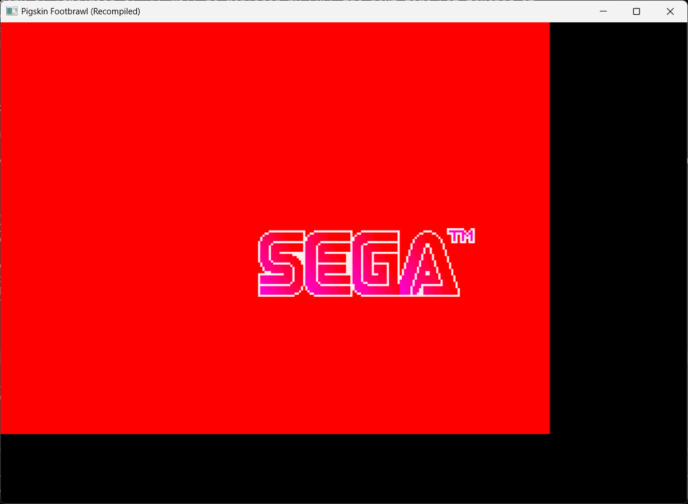

# PIGSKIN FOOTBRAWL: RECOMPILED

```
  ____  ___ ____ ____  _  _____ _   _
 |  _ \|_ _/ ___/ ___|| |/ /_ _| \ | |
 | |_) || | |  _\___ \| ' / | ||  \| |
 |  __/ | | |_| |___) | . \ | || |\  |
 |_|   |___\____|____/|_|\_\___|_| \_|
          F O O T B R A W L
```

**A static recompilation of Jerry Glanville's Pigskin Footbrawl (Sega Genesis, 1992)**

> *"It's not just football. It's medieval football. With swords."*

This project takes the original Motorola 68000 machine code from the Genesis ROM and translates it ahead-of-time into native C, then compiles it to run natively on modern hardware. No emulator in the loop -- the recompiled code IS the CPU, and real Genesis hardware (VDP, YM2612, PSG, Z80) is provided by [genrecomp](https://github.com/sp00nznet/genrecomp) via Genesis Plus GX.

---

## Current Status: SEGA Logo Renders, Game Running

The SEGA trademark screen renders correctly with the blue sweep effect. The game boots through full hardware init, loads the Z80 sound driver, and enters its TRAP-based cooperative task scheduler. The game loop runs stably for thousands of frames with VDP rendering active.



---

## Project Status

| Component | Status | Details |
|-----------|--------|---------|
| ROM Analysis | **Done** | 1,172 functions, 19,291 instructions discovered |
| Code Generation | **Done** | ~60K lines of recompiled C across 24 source files |
| Function Registration | **Done** | All 1,172 functions registered in dispatch table |
| Cross-func Resolution | **Done** | Iterative splitting until all call targets are registered |
| Entry Point | **Done** | Genesis init -> main game entry wired up |
| VBlank Handler | **Done** | IRQ6 handler + VBlank callback drives frame loop |
| TRAP Dispatch | **Done** | All 8 TRAP handlers (0-7) registered and dispatched |
| VDP Rendering | **Done** | SEGA logo renders, VDP output displayed via SDL2 |
| Input System | **Working** | Keyboard mapped (ENTER=START, arrows, Z/X/C=A/B/C) |
| Task Scheduler | **Running** | TRAP-based cooperative scheduling functional |
| Hardware Init | **Done** | VDP, Z80, DMA, palette, sprites all initialized |
| Sound Driver | **Loaded** | Z80 program copied to Z80 RAM (audio not yet playing) |
| Compilation | **Done** | Compiles + links to native .exe, zero errors |
| Attract Mode | **In Progress** | Game enters attract loop, needs debugging |
| Title Screen | **Not Yet** | Need to debug game state transitions |
| Full Gameplay | **Not Yet** | Need title screen first |

### Code Coverage

```
ROM Size:        1,048,576 bytes (1024 KB)
Code Discovered:    ~80 KB (7.6% of ROM)
Data (gfx/snd):   ~946 KB (92.4% of ROM)
Functions:            1,172 (from analysis + cross-func splitting)
Instructions:        19,291
Jump Tables:             61
Explicit Seeds:          17 (TRAP handlers, unreachable functions)
Native Binary:        ~3 MB (.exe)
Compile Errors:          0
Link Errors:             0
```

---

## How It Works

### The Pipeline

```
 .gen ROM file
      |
      v
 [analyze_rom.py]     -- Recursive-descent M68K disassembly
      |                   Function boundary detection
      |                   Jump table + prologue scanning
      |                   Explicit seed addresses
      v
 functions.json        -- Machine-readable function map
      |
      v
 [generate_recomp.py]  -- M68K -> C translation
      |                    Iterative cross-function resolution
      |                    BTST memory fix (always byte-sized)
      |                    TRAP -> func_table_call dispatch
      |                    Fall-through function chaining
      v
 src/recomp/*.c        -- Native C code (24 files, 1,172 functions)
 src/main.c            -- VBlank-driven frame loop
      |
      v
 [CMake + compiler]    -- Links against genrecomp + Genesis Plus GX
      |
      v
 pigskin.exe           -- Native executable, real Genesis hardware
```

### What the Recompiled Code Looks Like

Original M68K:
```asm
  0ECA24:  CLR.W   ($FF8E76).l
  0ECA2A:  CLR.W   ($FFB53A).l
  0ECA30:  MOVE.B  #$03, ($FFB9A8).l
  0ECA36:  LEA     $080000, A0
  0ECA3C:  MOVE.W  #$0040, D1
```

Recompiled C:
```c
    bus_write16(0xFF8E76, 0);
    g_m68k.flag_N = false; g_m68k.flag_Z = true;
    bus_write16(0xFFB53A, 0);
    g_m68k.flag_N = false; g_m68k.flag_Z = true;
    bus_write8(0xFFB9A8, 0x3);
    g_m68k.a[0] = 0x080000;
    g_m68k.d[1] = (g_m68k.d[1] & 0xFFFF0000u) | ((uint16_t)(0x40));
```

Every M68K instruction becomes a C statement. Registers live in `g_m68k`. Memory goes through `bus_read`/`bus_write` which hits real Genesis Plus GX hardware. Branches become `goto`. Calls go through `func_table_call()`.

---

## Runtime Architecture

The game uses a **TRAP-based cooperative task scheduler** -- it never returns from `entry_point()`. The frame loop is driven by VBlank callbacks:

```
entry_point()
  -> main_game_entry()
    -> game main loop (TRAP #0 = wait VBlank, TRAP #4 = sound, TRAP #7 = DMA)
      -> task scheduler dispatches per-frame handlers
        -> VBlank callback fires from bus cycle simulation
          -> SDL event pump + input update
          -> VDP rendering (render_line per scanline)
          -> SDL frame present
```

### Key Runtime Fixes

- **VDP Cycle Simulation** -- v_counter advances during bus accesses for scanline-polling loops
- **DMA Busy Auto-Clear** -- VDP DMA completes instantly (no cycle-accurate interleaving)
- **Z80 Bus Pre-Grant** -- Z80 bus always available, BUSREQ/RESET writes stubbed
- **VBlank Callback** -- Fires when simulated scanline crosses line 224
- **TRAP Dispatch** -- All 8 TRAP vectors dispatch to handlers via func_table_call
- **Fall-Through Chaining** -- Functions without RTS call their successor function
- **Recursive Loop Conversion** -- BSR-based loops converted to goto loops to prevent stack overflow

---

## Building

### Prerequisites

- CMake 3.16+
- C compiler (MSVC, Clang, or GCC)
- SDL2 development libraries
- [genrecomp](https://github.com/sp00nznet/genrecomp) checked out alongside this project

### Directory Layout

```
gen/
  genrecomp/        <-- Genesis recomp toolkit
  pigskin/          <-- This project (you are here)
```

### Build

```bash
cd pigskin
cmake -B build -G "Visual Studio 17 2022" -DCMAKE_TOOLCHAIN_FILE=C:/vcpkg/scripts/buildsystems/vcpkg.cmake -DSDL2_DIR="C:/vcpkg/installed/x64-windows/share/sdl2"
cmake --build build --config Release
```

### Run

```bash
./build/Release/pigskin "Jerry Glanville's Pigskin Footbrawl (USA).gen"
```

Controls: Arrow keys = D-pad, Z/X/C = A/B/C, ENTER = START, ESC = quit.

You'll need the original ROM file. This project does not include it.

---

## Tools

### `tools/analyze_rom.py`

```bash
python tools/analyze_rom.py rom.gen --stats --output functions.json
```

Features: recursive-descent disassembly, jump table scanning, prologue detection (LINK/MOVEM), explicit seed addresses, address-load pattern detection.

### `tools/generate_recomp.py`

```bash
python tools/generate_recomp.py rom.gen --output-dir src/recomp/
```

Features: iterative cross-function resolution, BTST byte-size fix, TRAP vector dispatch, fall-through chaining, computed JSR handling.

---

## What's Next

- [x] SEGA logo rendering with blue sweep effect
- [x] TRAP-based task scheduler running
- [x] Input system connected (keyboard -> GPGX I/O)
- [x] Stable 1000+ frame operation
- [ ] Debug attract mode display (compare with emulator)
- [ ] Fix "push return + JMP" computed call pattern systematically
- [ ] Get title screen visible
- [ ] Get to gameplay
- [ ] Audio output (Z80 sound driver integration)
- [ ] Full playable recompilation

---

## Related Projects

- [genrecomp](https://github.com/sp00nznet/genrecomp) -- Genesis/Mega Drive recomp toolkit
- [recompclass](https://github.com/sp00nznet/recompclass) -- Learn static recompilation from scratch

---

## License

MIT. The recompilation tools and generated code are open source. You'll need your own legally obtained ROM to use this.
